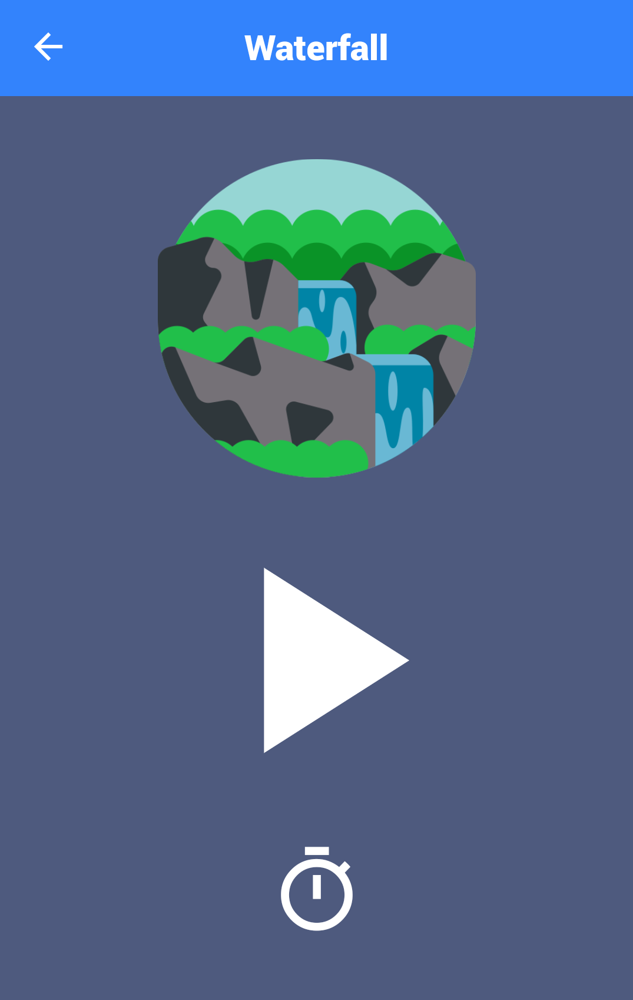

# Relaxing Sounds

 

  

  Relax with nature sounds.

## Built With

Flutter - Google's app development framework. (https://flutter.io)

## Features

- Pick and play a sound from a list of different sounds.
- Set a timer to stop the sound.
- Background play on android.

 

  
  

## Download & install

First, clone the repository with the 'clone' command, or just download the zip.

Then, download either Android Studio or Visual Studio Code, with their respective [Flutter editor plugins](https://flutter.io/get-started/editor/). For more information about Flutter installation procedure, check the [official install guide](https://flutter.io/get-started/install/).

Install dependencies from pubspec.yaml by running `flutter packages get` from the project root (see [using packages documentation](https://flutter.io/using-packages/#adding-a-package-dependency-to-an-app) for details and how to do this in the editor).

There you go, you can now open & edit the project. Enjoy!

## Contributing

Feel free to add issues with bugs or ideas. Any pull requests are very welcome!

## Assets Lincense

[Assets Lincense (Icons and Sounds)](assets/about/about.md)
